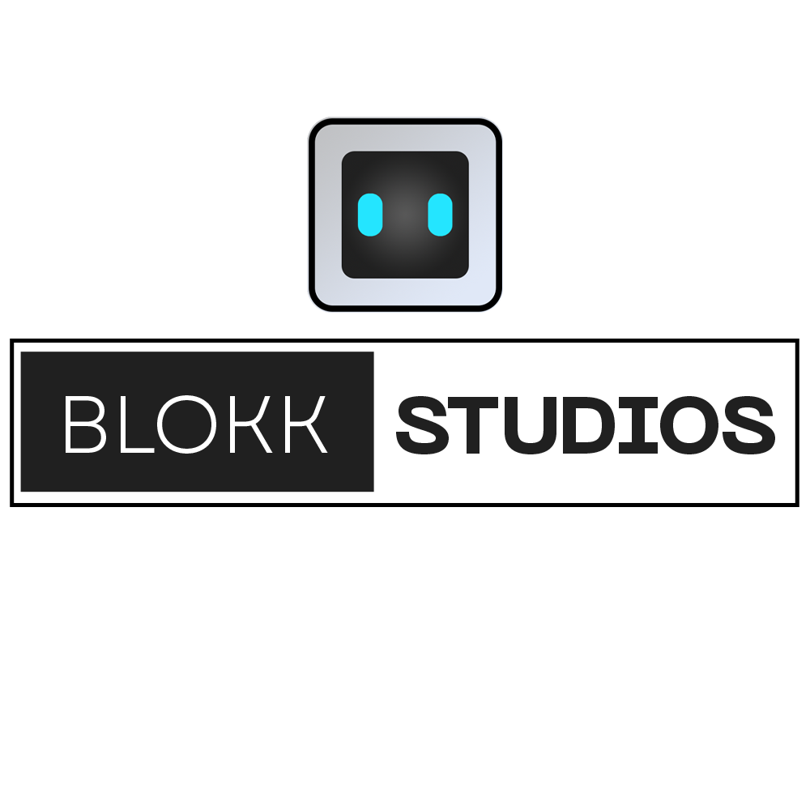
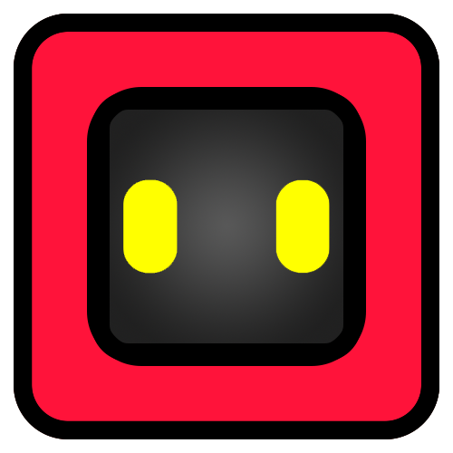
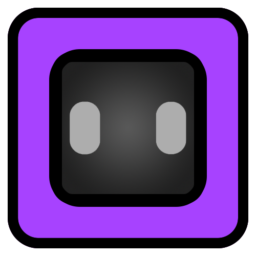
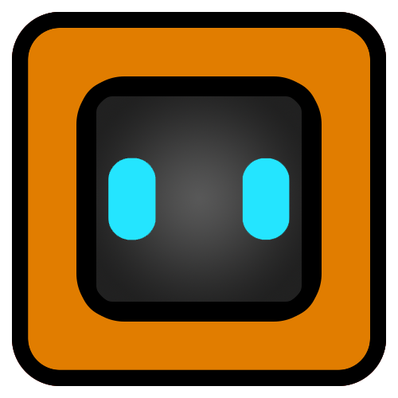
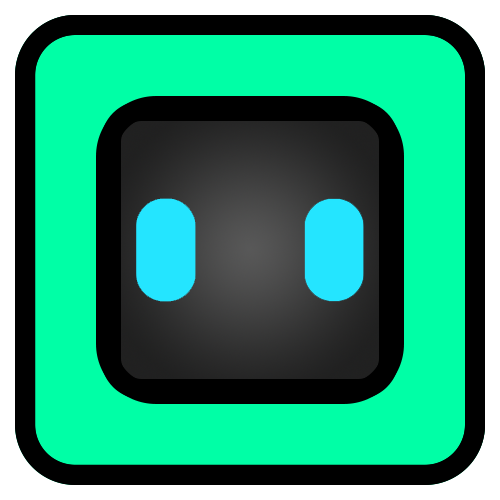
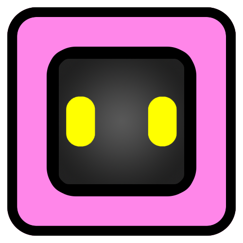

##   Olá, somos a Blokk Studios Software House!

 

 
Somos uma equipe dinâmica e inovadora especializada em soluções de software full stack. Fundada em 2024, nossa missão é desenvolver soluções tecnológicas eficientes e inovadoras para uma variedade de desafios do mundo digital.

Nossa expertise abrange desde o desenvolvimento de aplicativos até soluções de back-end robustas, sempre com foco em entregar produtos de alta qualidade que atendam às necessidades específicas de nossos clientes.

Estamos sempre em busca de novas tecnologias e tendências para garantir que nossos serviços sejam os mais atualizados e eficazes possíveis. Se você está procurando por uma parceria para desenvolver soluções tecnológicas, estamos aqui para ajudar!

## Equipe Blokk Studios 
- **Cassiano Braz - Backend Developer / Cybersecurity**   
- **Fernanda Alves - PostGIS / DBA - Database Administrator**   
- **Gabriel Paulo - Backend Developer / DBA - Database Administrator**   
-  **Jhonatan Carvalho - FullStack Developer / Data Analyst**  
- **Maurício - Backend Developer / Cybersecurity**   
- **Thalita - Speciality1 / Speciality2**   
- **Vinícius - Speciality1 / Speciality2**   

<h2 align="left"> 
🚀 Tecnologias Usadas:
</h2>

<!-- Adicione mais tecnologias conforme necessário -->

  💌 Se você tem interesse em nossos serviços ou deseja saber mais, fique à vontade para entrar em contato: ⤵️

 

<!-- Aqui você pode adicionar widgets de estatísticas do GitHub, se desejar -->

 

  <!-- Aqui você pode adicionar troféus do GitHub ou outras conquistas, se desejar -->

<a target="_blank" href="https://icons8.com/icon/1RueIplXPGd2/chatbot">Bot</a> icon by <a target="_blank" href="https://icons8.com">Icons8</a>
